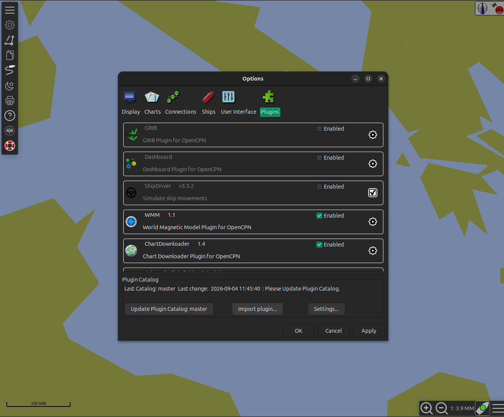
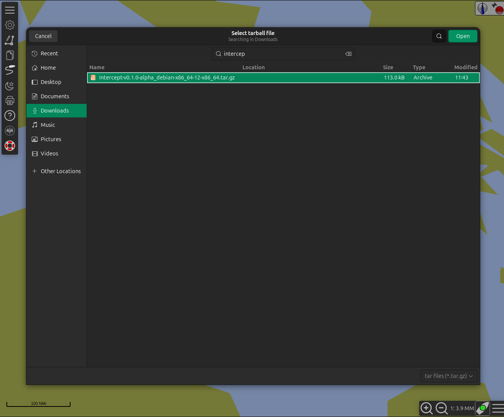
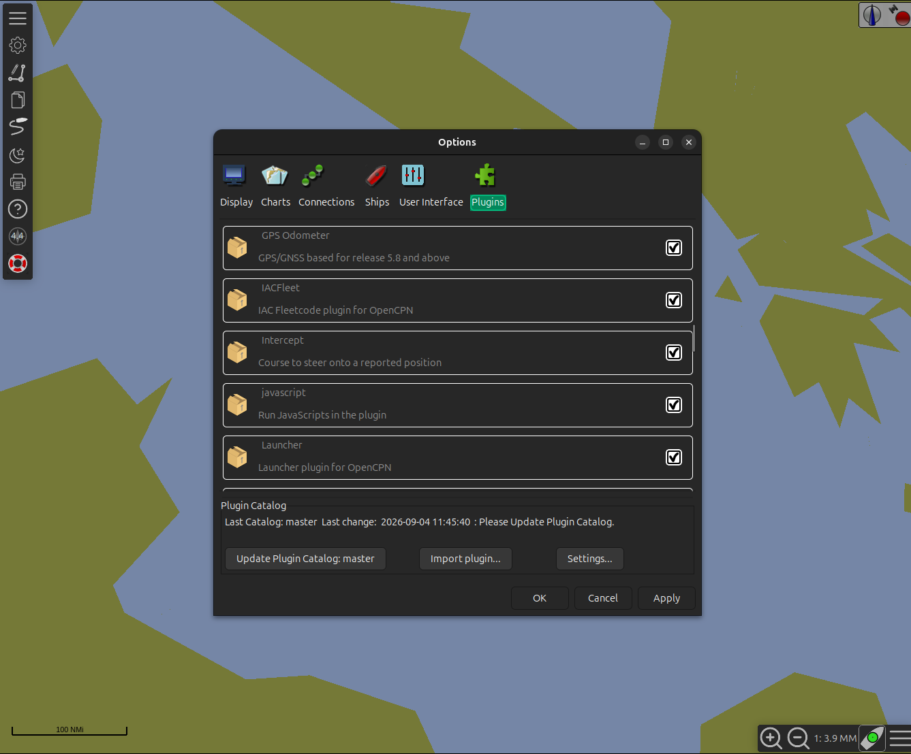
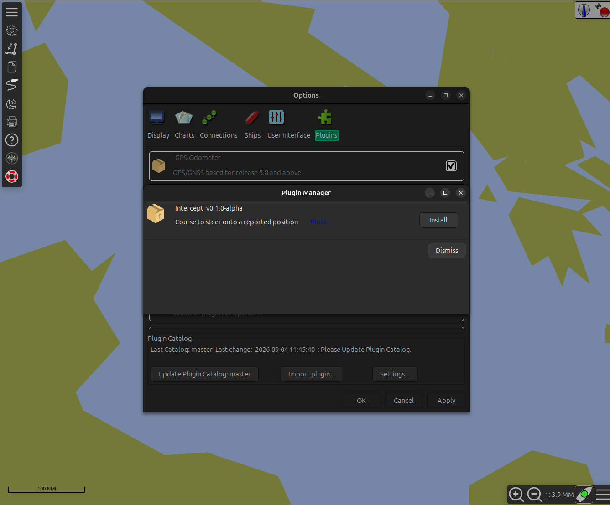
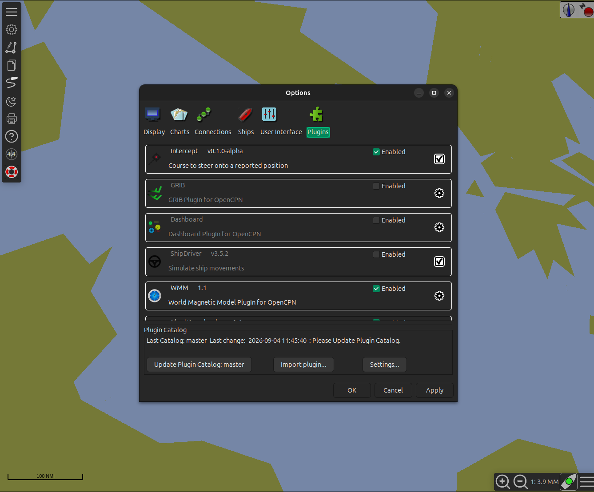
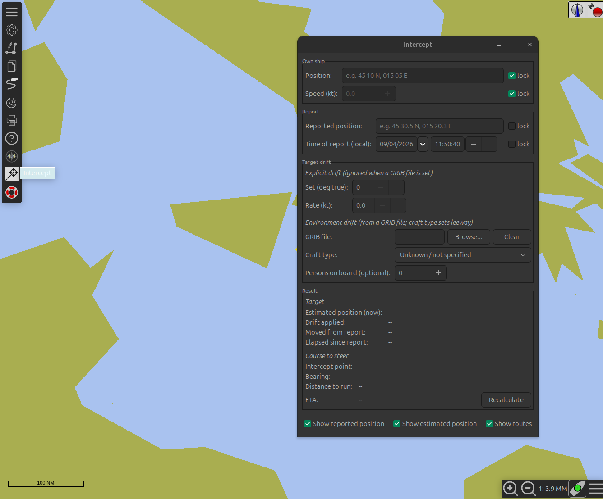
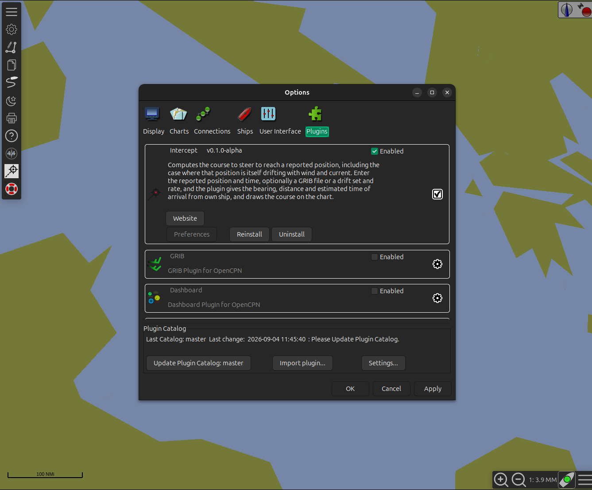

# Installing and removing the Intercept plugin

> **Read the [disclaimer](../README.md#-disclaimer) first.** This is alpha
> software, not verified for operational use.

The plugin is **not** in the OpenCPN plugin catalogue. Install it from a
release tarball through OpenCPN's own plugin manager — that way OpenCPN
tracks it and you get a proper **Uninstall** button later.

## 1. Download the tarball

From the [releases page](https://github.com/MorRue/intercept_pi/releases),
download the archive for your platform:

| Platform | File |
|---|---|
| Linux (x86-64, glibc ≥ 2.36 — Debian 12+, Ubuntu 22.04+) | `Intercept-<version>_debian-x86_64-…​.tar.gz` |
| Windows (32-bit — matches OpenCPN's official build) | `Intercept-<version>_msvc-wx32-…​.tar.gz` |

Do **not** unpack it. OpenCPN reads the `.tar.gz` directly.

Requires OpenCPN **5.8 or newer** (plugin API 1.18).

## 2. Import it

In OpenCPN: **Options → Plugins** tab, then **Import plugin…** at the
bottom.



Select the `.tar.gz` you downloaded and click **Open**.



## 3. Install it

"Intercept — Course to steer onto a reported position" appears in the list,
and a small **Plugin Manager** window offers **Install**. Click it.





## 4. Done

Intercept moves to the top of the list with a green **Enabled** tick. Click
**OK** (or **Apply**) to close Options.



A crosshair **Intercept** button is now on the toolbar. Click it to toggle
the panel.



If the toolbar button or panel does not appear, restart OpenCPN once.

---

## Removing the plugin

### If you installed it via the plugin manager (the steps above)

**Options → Plugins**, click the **Intercept** entry to expand it, then
click **Uninstall**.



Click **OK** to close Options, and restart OpenCPN.

### If you copied the library by hand

OpenCPN only shows **Uninstall** for plugins it installed itself. A
library you copied into the plugin directory yourself has no Uninstall
button — delete the files and restart OpenCPN:

**Linux**

```sh
rm ~/.local/lib/opencpn/libintercept_pi.so
rm -rf ~/.local/share/opencpn/plugins/intercept_pi
# also check the system paths if you installed there:
#   /usr/lib/opencpn/  /usr/local/lib/opencpn/  and the matching share/ dirs
```

**Windows** — delete `intercept_pi.dll` from OpenCPN's `plugins\` folder
(next to `opencpn.exe`, or under `%APPDATA%\OpenCPN\`) and the
`plugins\intercept_pi\` data folder.

**macOS** — delete `libintercept_pi.dylib` and the `intercept_pi/` data
folder from `~/Library/Application Support/OpenCPN/Contents/PlugIns/` (or
wherever you copied them).

---

## For developers: quick local test without the plugin manager

Copying the freshly built library straight into the plugin directory is
faster than repackaging, but OpenCPN then treats it as unmanaged — **no
Uninstall button** (remove it as above). A locally built library also
links against your machine's libraries and may not load on another
machine; ship the CI-built tarball.

```sh
cmake -B build -DCMAKE_BUILD_TYPE=Release
cmake --build build -j"$(nproc)" --target tarball
./scripts/install-local.sh          # copies into ~/.local
# then restart OpenCPN
```
